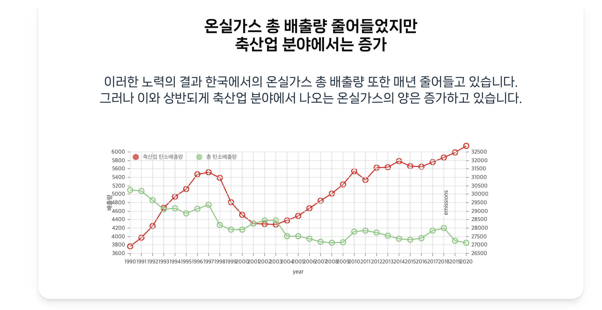
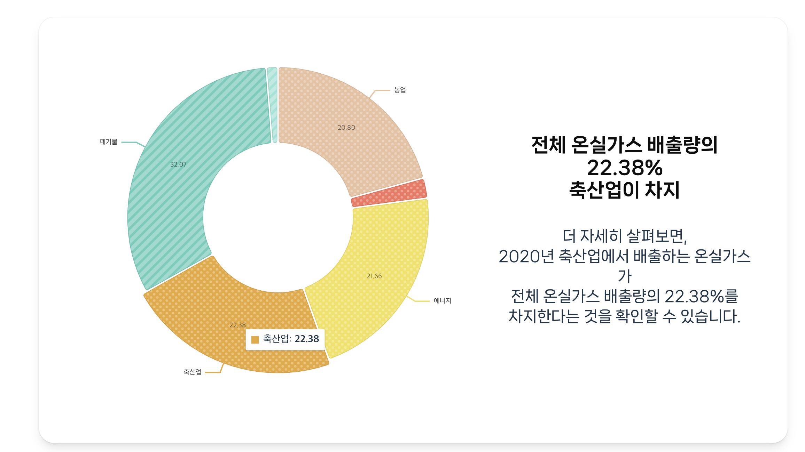
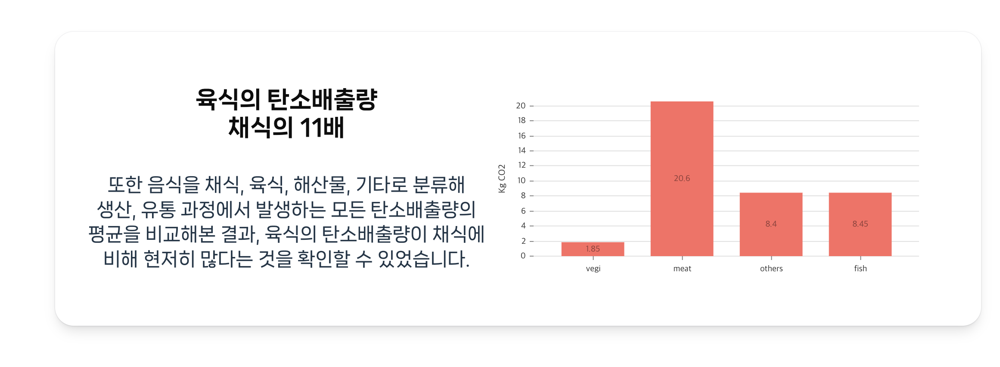

# 🌱 하루 한끼의 채식! 지구의 내일을 바꿔요!

<br/>


<br/>

## 📄 개요

-   서비스명: 오채완
-   기획 기간: 2023.05.26 ~ 2023.06.01
-   개발 기간: 2023.06.01 ~ 2023.06.16
-   주제: 환경 보호
-   목표: 데이터 분석 수치를 활용해 **육류소비의 탄소배출량의 심각성 파악** 및 **유저 간 채식문화 장려 하는 서비스 제공**
-   API 문서: [바로가기](https://docs.google.com/spreadsheets/d/1t-DNUbVY4GI5NZWTBwCLrzPFFoJMj4t_p9wfY_jemhA/edit?usp=sharing)
-   테스트 페이지: [바로가기](http://kdt-ai7-team07.elicecoding.com/)

<br/>

## 🫶 팀원 소개

**민준영**

-   Back-End
-   znddiqjwjs@gmail.com
-   Github: [@minluna](https://github.com/minluna)

**정재훈**

-   Back-End
-   wjdwogns120523@gmail.com
-   Github: [@J-A-Y2](https://github.com/J-A-Y2)

**김지원**

-   Back-End
-   0o0w0d2@gmail.com
-   Github: [0o0w0d2](https://github.com/0o0w0d2)

**이영현**

-   Front-End
-   pisouz7@gmail.com
-   Github:[@yyoungl](https://github.com/yyoungl)

**최우현**

-   Front-End
-   woohyun6549@gamil.com
-   Github: [@choiwoohyun123](https://github.com/choiwoohyun123)

<br/>

## 기술 스택

### Front-End

<div>


</div>
<br />


### Back-End

<div>


</div>

<br />

### Server-Infra

<div>


</div>

#### **데이터 분석**

<div>


</div>

<br />

### 프로젝트 기획

<br/>

- 서비스 배경 : 저희는 일상생활에서 쉽게 환경 보호를 실천할 수 있는 방법을 고안했습니다. 지구온난화는 전세계적인 이슈로, 이산화탄소나 메탄 같은 탄소가스가 대기의 열을 붙잡음으로써 일어나는 온실 효과가 주된 원인입니다. 이로 인해 지구의 평균 기온이 상승하고, 이상기후가 나타나고 있습니다. 원인별 탄소배출량과 연관성을 분석해 본 결과, “채식”을 함으로써 탄소배출 감소에 기여하고자 만든 “오늘 채식 완료＂라는 서비스가 탄생하였습니다.

<br/>

### 가공한 데이터



- 축산업이 탄소배출량에 미치는 영향에 대해 알아보았습니다. 1990년도부터 2020년까지 한국의 총 온실가스 배출량은 줄었지만, 축산업 분야에서 배출한 온실가스의 경우 증가했습니다. 



- 전체 산업군 배출량 중 축산업의 온실가스 배출량은 20% 이상을 차지합니다.



- 음식을 채소류, 육류, 해산물, 기타로 분류해 탄소배출량의 평균을 확인해 보았습니다. <br/>
이는 생산부터 유통까지 모든 과정에서 배출된 온실가스의 양을 의미합니다.<br/>
채소류를 소비 과정에서 배출하는 탄소배출량은 육류 소비 과정에서 탄소배출량에 비해 무려 11배나 낮은 것을 확인할 수 있습니다!<br/>

<br/>
## 🔎 주요기능

-   **회원가입, 로그인 기능**: 사용자의 회원 가입 및 로그인 기능 제공

-   **식단 업로드 기능**: 비건, 베지테리언 식단 업로드 가능

-   **피드 댓글, 대댓글 기능**: 식단 피드에서 댓글, 대댓글을 통해 유저들과 소통 가능

-   **탄소 배출 감소량에 따른 포인트 부여**: 식단 피드 업로드하면 포인트 부여

-   **마이페이지 기능**:
    -   개인 정보, 포인트, 좋아요 등을 확인할 수 있는 마이페이지 기능 제공
    -   개인 정보, 포인트, 좋아요 등
    -   올린 식단 사진 archive
    -   좋아요한 피드 archive

-   **개인정보수정 기능**: 닉네임, 프로필사진, 자기소개 수정 가능

-   **건강 배틀 sns**: 포인트 적립 순위 리스트(랭킹) 기능

-   **Infinite Scroll**: 스크롤을 통해 오래된 피드도 볼 수 있게 하여 사용자의 몰입도를 높이기 위한 기능

-   **게시물 검색 기능**: 검색한 내용과 일치하는 모든 피드들을 볼 수 있는 기능

## 🗂 프로젝트 구조

### [Front-End ](#)

```
📦src
 ┣ 📂components
 ┃ ┣ 📂datagraph
 ┃ ┃ ┣ 📂data
 ┃ ┃ ┃ ┣ 📜co2bargarphdata.js
 ┃ ┃ ┃ ┣ 📜linegraphdata.js
 ┃ ┃ ┃ ┗ 📜piegraphdata.js
 ┃ ┃ ┗ 📂graph
 ┃ ┃ ┃ ┣ 📜bargraph.jsx
 ┃ ┃ ┃ ┣ 📜co2bargraph.jsx
 ┃ ┃ ┃ ┣ 📜linegraph.css
 ┃ ┃ ┃ ┣ 📜linegraph.jsx
 ┃ ┃ ┃ ┗ 📜piegraph.jsx
 ┃ ┣ 📂pointbar
 ┃ ┃ ┗ 📜pointbar.jsx
 ┃ ┣ 📂post
 ┃ ┃ ┣ 📜addpost.jsx
 ┃ ┃ ┣ 📜postcard.jsx
 ┃ ┃ ┣ 📜postdetail.jsx
 ┃ ┃ ┗ 📜postedit.jsx
 ┃ ┣ 📂rankcard
 ┃ ┃ ┗ 📜rankcard.jsx
 ┃ ┣ 📂rankpagesentence
 ┃ ┃ ┗ 📜rankpagesentence.jsx
 ┃ ┗ 📂user
 ┃ ┃ ┣ 📜usercard.jsx
 ┃ ┃ ┣ 📜userdetail.jsx
 ┃ ┃ ┗ 📜useredit.jsx
 ┣ 📂pages
 ┃ ┣ 📂login
 ┃ ┃ ┗ 📜loginform.jsx
 ┃ ┣ 📂mainpage
 ┃ ┃ ┗ 📜mainpage.jsx
 ┃ ┣ 📂rank
 ┃ ┃ ┗ 📜rank.jsx
 ┃ ┣ 📂register
 ┃ ┃ ┗ 📜registerform.jsx
 ┃ ┣ 📂story
 ┃ ┃ ┣ 📜searchpost.jsx
 ┃ ┃ ┗ 📜story.jsx
 ┃ ┣ 📜loading.jsx
 ┃ ┗ 📜notfound.jsx
 ┣ 📂sections
 ┃ ┣ 📜header.jsx
 ┃ ┗ 📜headerlogout.jsx
 ┗ 📂utils
 ┃ ┣ 📂conts
 ┃ ┃ ┗ 📜bucket.js
 ┃ ┣ 📜chunkArray.js
 ┃ ┣ 📜getdays.js
 ┃ ┣ 📜gethours.js
 ┃ ┣ 📜gettime.js
 ┃ ┗ 📜tierdecision.js> `
```

### [Back-End](#)

```
📦src
 ┣ 📂controllers
 ┃ ┣ 📜commentController.js
 ┃ ┣ 📜likeController.js
 ┃ ┣ 📜postController.js
 ┃ ┣ 📜rankController.js
 ┃ ┣ 📜searchController.js
 ┃ ┗ 📜userController.js
 ┣ 📂db
 ┃ ┣ 📂models
 ┃ ┃ ┣ 📜Comment.js
 ┃ ┃ ┣ 📜Like.js
 ┃ ┃ ┣ 📜Post.js
 ┃ ┃ ┣ 📜Rank.js
 ┃ ┃ ┣ 📜Search.js
 ┃ ┃ ┗ 📜User.js
 ┃ ┗ 📜index.js
 ┣ 📂middlewares
 ┃ ┣ 📜addComment_validate.js
 ┃ ┣ 📜addPost_validate.js
 ┃ ┣ 📜commentParams_validate.js
 ┃ ┣ 📜errorMiddleware.js
 ┃ ┣ 📜getComment_validate.js
 ┃ ┣ 📜getPost_vaildate.js
 ┃ ┣ 📜login_required.js
 ┃ ┣ 📜login_validate.js
 ┃ ┣ 📜postParams_validate.js
 ┃ ┣ 📜register_validate.js
 ┃ ┣ 📜search_validate.js
 ┃ ┣ 📜setComment_validate.js
 ┃ ┣ 📜setPost_validate.js
 ┃ ┣ 📜setUser_validate.js
 ┃ ┗ 📜userParams_validate.js
 ┣ 📂routers
 ┃ ┣ 📜commentRouter.js
 ┃ ┣ 📜likeRouter.js
 ┃ ┣ 📜postRouter.js
 ┃ ┣ 📜rankRouter.js
 ┃ ┣ 📜searchRouter.js
 ┃ ┗ 📜userRouter.js
 ┣ 📂services
 ┃ ┣ 📜commentService.js
 ┃ ┣ 📜likeService.js
 ┃ ┣ 📜postService.js
 ┃ ┣ 📜rankService.js
 ┃ ┣ 📜searchService.js
 ┃ ┗ 📜userService.js
 ┣ 📂utils
 ┃ ┗ 📜statusCode.js
 ┣ 📜app.js
 ┣ 📜aws.config.js
 ┗ 📜babel.config.json
```

<br/>

## 🏁 테스트 방법

---

1. 해당 프로젝트를 clone 합니다.

    ```
    git clone https://github.com/J-A-Y2/project2.git
    ```

2. 프로젝트 실행에 필요한 패키지를 설치합니다.

   ```
    cd vegcom_front
    yarn install
    ```

    ```
    cd vegcom_back
    yarn install
    ```

4. 프론트와 백엔드를 실행합니다.

    ```
    cd vegcom_front
    yarn dev
    ```

    ```
    cd vegcom_back
    yarn start
    ```
